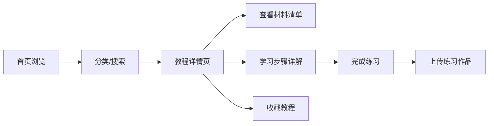
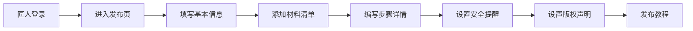
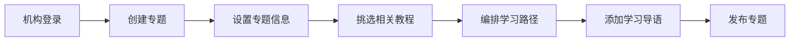

## 1. 产品概述

传统手工艺教程馆是一个专注于非遗手工艺传承与学习的在线平台，连接匠人、学习者与非遗机构，提供竹编、漆器、剪纸、扎染等传统工艺的系统化教学内容。

- **核心价值**：保护和传承非物质文化遗产，让传统手工艺走进大众生活
- **目标用户**：手工艺匠人、手工艺爱好者/学习者、非遗保护机构

## 2. 核心功能

### 2.1 用户角色

| 角色 | 注册方式 | 核心权限 |
|------|----------|----------|
| 匠人 | 身份认证注册 | 发布教程、管理作品、查看学习反馈 |
| 学习者 | 手机号/邮箱注册 | 浏览教程、收藏教程、上传练习作品、参与专题学习 |
| 非遗机构 | 机构认证注册 | 整理专题路径、认证匠人、授权转载 |

### 2.2 功能模块

1. **首页**：精选教程轮播、分类导航、热门匠人、专题推荐
2. **教程列表页**：分类筛选、难度筛选、搜索、教程卡片展示
3. **教程详情页**：材料清单、步骤详解、难度等级、安全提醒、收藏功能、评论区、练习作品展示
4. **匠人发布页**：教程发布表单（材料/步骤/难度/安全提醒/版权声明）
5. **个人中心**：我的收藏、我的作品、我的发布（匠人）
6. **专题路径页**：非遗机构整理的系统化学习路径、专题详情

### 2.3 页面详情

| 页面名称 | 模块名称 | 功能描述 |
|----------|----------|----------|
| 首页 | 顶部导航 | Logo、分类菜单、搜索框、用户入口 |
| 首页 | Hero 轮播 | 精选教程大图轮播，自动切换 |
| 首页 | 工艺分类 | 竹编/漆器/剪纸/扎染四大分类入口卡片 |
| 首页 | 热门匠人 | 匠人头像、简介、作品数展示 |
| 首页 | 专题推荐 | 非遗机构整理的专题路径卡片 |
| 教程列表页 | 筛选栏 | 分类、难度、排序筛选 |
| 教程列表页 | 教程卡片 | 封面图、标题、难度、作者、收藏数 |
| 教程详情页 | 教程头部 | 封面、标题、作者、难度、收藏按钮 |
| 教程详情页 | 材料清单 | 所需材料列表，含图片和用量 |
| 教程详情页 | 步骤详解 | 分步骤图文教程，支持展开收起 |
| 教程详情页 | 安全提醒 | 醒目警示区域，标注安全注意事项 |
| 教程详情页 | 版权声明 | 转载授权说明、来源信息 |
| 教程详情页 | 练习作品墙 | 学习者上传的练习作品展示 |
| 教程详情页 | 上传作品 | 学习者提交自己的练习作品 |
| 匠人发布页 | 发布表单 | 多步骤表单：基本信息、材料、步骤、安全提醒 |
| 个人中心 | 我的收藏 | 收藏的教程列表，可取消收藏 |
| 个人中心 | 我的作品 | 上传的练习作品管理 |
| 专题路径页 | 专题列表 | 非遗机构发布的学习路径专题 |
| 专题详情页 | 路径展示 | 阶梯式学习路径，包含多个教程 |

## 3. 核心流程

### 3.1 学习者浏览学习流程
学习者进入首页，通过分类或搜索找到感兴趣的教程，查看教程详情中的材料和步骤，收藏喜欢的教程，完成练习后上传作品。

### 3.2 匠人发布教程流程
匠人登录后进入发布页面，填写教程基本信息、材料清单、详细步骤和安全提醒，设置版权授权后发布。

### 3.3 非遗机构专题整理流程
非遗机构选择相关教程，按照学习进阶顺序组织成专题路径，添加导语和学习建议后发布。

## 4. 用户界面设计

### 4.1 设计风格

- **设计理念**：东方美学与现代简约结合，体现传统工艺的温润质感
- **主色调**：朱砂红 (#C84B31) —— 象征传统与热情
- **辅助色**：竹青 (#7BA05B)、漆墨黑 (#2C2C2C)、米白 (#F5F0E6)、赭石 (#B5651D)
- **按钮风格**：圆角矩形，微立体感，hover 时有轻微上浮效果
- **字体**：标题用「思源宋体」体现传统韵味，正文用「思源黑体」保证可读性
- **布局风格**：卡片式布局，大量留白，穿插传统纹样装饰
- **图标风格**：线性图标，融入传统元素（如意纹、回字纹等）

### 4.2 页面设计概览

| 页面名称 | 模块名称 | UI 元素 |
|----------|----------|---------|
| 首页 | Hero 轮播 | 大尺寸传统工艺作品图，渐隐切换，文字叠加 |
| 首页 | 分类卡片 | 四色分区卡片，悬停时轻微放大 + 阴影加深 |
| 教程详情页 | 步骤区域 | 竖向时间线布局，步骤编号用印章样式 |
| 教程详情页 | 安全提醒 | 朱砂红警示框，配警示图标，醒目但不刺眼 |
| 教程详情页 | 版权声明 | 浅米色底，细边框，仿古籍落款样式 |
| 专题详情页 | 学习路径 | 阶梯式纵向排布，连接线用传统纹样 |

### 4.3 响应式设计

- 桌面端优先，适配 1200px+ 宽度
- 平板端（768px-1199px）：两列布局，导航简化
- 移动端（<768px）：单列布局，底部导航栏，汉堡菜单
- 触摸优化：按钮最小 44px，列表项增加点击区域

### 4.4 动效设计

- 页面加载：内容渐入 + 轻微上移，交错出现
- 卡片悬停：上浮 4px + 阴影扩散
- 步骤展开：平滑高度过渡 + 内容淡入
- 收藏按钮：心形图标填充动画 + 轻微弹跳
- 滚动触发：关键区域进入视口时渐显
