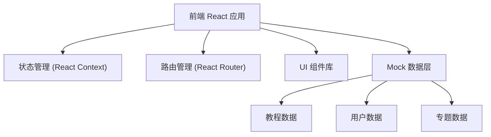
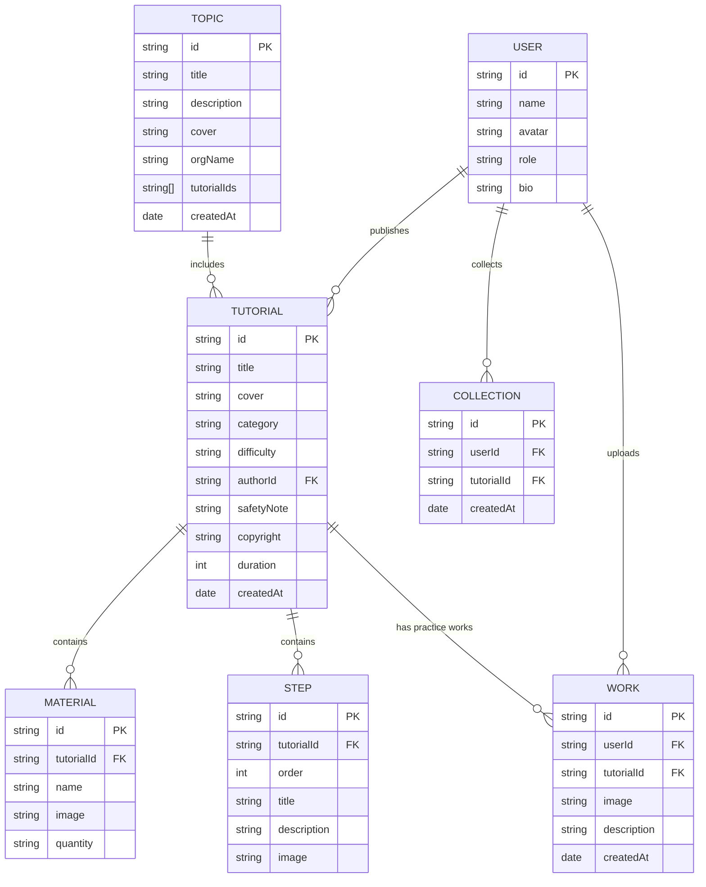

## 1. 架构设计



## 2. 技术选型

- **前端框架**：React@18 + TypeScript
- **构建工具**：Vite@5
- **样式方案**：TailwindCSS@3
- **路由管理**：react-router-dom@6
- **图标库**：Lucide React
- **状态管理**：React Context + useReducer
- **数据方案**：前端 Mock 数据（localStorage 持久化）

## 3. 目录结构

```
src/
├── components/          # 通用组件
│   ├── Header/          # 顶部导航
│   ├── Footer/          # 页脚
│   ├── TutorialCard/    # 教程卡片
│   ├── StepItem/        # 步骤项
│   ├── MaterialItem/    # 材料项
│   └── SafetyAlert/     # 安全提醒组件
├── pages/               # 页面组件
│   ├── Home/            # 首页
│   ├── TutorialList/    # 教程列表
│   ├── TutorialDetail/  # 教程详情
│   ├── Publish/         # 发布教程
│   ├── Profile/         # 个人中心
│   ├── Topics/          # 专题列表
│   └── TopicDetail/     # 专题详情
├── context/             # 状态管理
│   ├── UserContext.tsx  # 用户状态
│   └── TutorialContext.tsx # 教程状态
├── data/                # Mock 数据
│   ├── tutorials.ts     # 教程数据
│   ├── users.ts         # 用户数据
│   └── topics.ts        # 专题数据
├── types/               # TypeScript 类型
│   └── index.ts
├── utils/               # 工具函数
│   ├── storage.ts       # 本地存储
│   └── format.ts        # 格式化工具
├── App.tsx
├── main.tsx
└── index.css
```

## 4. 路由定义

| 路由 | 页面 | 说明 |
|------|------|------|
| `/` | 首页 | 精选内容、分类导航、热门匠人 |
| `/tutorials` | 教程列表 | 分类筛选、搜索、教程卡片 |
| `/tutorials/:id` | 教程详情 | 材料、步骤、安全提醒、作品墙 |
| `/publish` | 发布教程 | 匠人发布新教程（需登录） |
| `/profile` | 个人中心 | 我的收藏、我的作品 |
| `/topics` | 专题列表 | 非遗机构专题路径 |
| `/topics/:id` | 专题详情 | 学习路径详情 |

## 5. 数据模型

### 5.1 数据模型 ER 图



### 5.2 核心类型定义

```typescript
// 用户类型
interface User {
  id: string;
  name: string;
  avatar: string;
  role: 'learner' | 'artisan' | 'institution';
  bio: string;
}

// 教程类型
interface Tutorial {
  id: string;
  title: string;
  cover: string;
  category: 'bamboo' | 'lacquer' | 'papercut' | 'tieDye';
  difficulty: 'beginner' | 'intermediate' | 'advanced';
  authorId: string;
  duration: number; // 分钟
  safetyNote: string;
  copyright: string;
  source?: string;
  materials: Material[];
  steps: Step[];
  createdAt: string;
  collectCount: number;
}

// 材料类型
interface Material {
  id: string;
  name: string;
  image?: string;
  quantity: string;
}

// 步骤类型
interface Step {
  id: string;
  order: number;
  title: string;
  description: string;
  image?: string;
}

// 练习作品
interface Work {
  id: string;
  userId: string;
  tutorialId: string;
  image: string;
  description: string;
  createdAt: string;
}

// 专题
interface Topic {
  id: string;
  title: string;
  description: string;
  cover: string;
  orgName: string;
  tutorialIds: string[];
  intro: string;
  createdAt: string;
}
```

## 6. 核心功能实现方案

### 6.1 教程发布
- 多步骤表单：基本信息 → 材料清单 → 步骤详情 → 安全提醒与版权
- 图片上传使用 base64 存储到 localStorage
- 表单验证：必填项校验、步骤至少3步

### 6.2 收藏功能
- 使用 localStorage 存储用户收藏列表
- 收藏按钮带心形动画效果
- 个人中心可查看和管理收藏

### 6.3 练习作品上传
- 图片文件转 base64 存储
- 作品展示在教程详情页底部
- 支持作品描述和作者信息

### 6.4 专题路径
- 非遗机构账号可创建专题
- 阶梯式路径展示，体现学习进阶
- 每个教程在路径中显示完成状态

### 6.5 版权与转载
- 每个教程底部显示版权声明
- 显示转载授权方式
- 标注原始来源和作者信息
